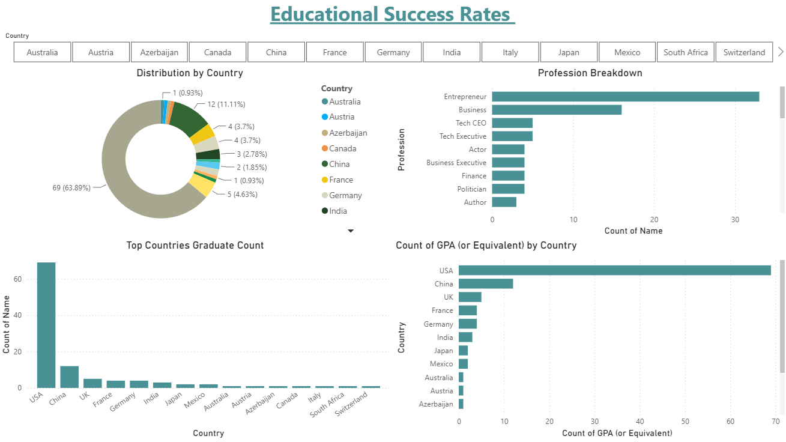

# Graduate Demographics Dashboard (Power BI)

An interactive Power BI report analyzing graduate profiles by profession and country, highlighting where graduates are concentrated and what fields they work in.

## 📊 Overview
This dashboard provides a snapshot of graduate demographics, breaking down professional fields and geographic distribution to identify key trends.

## Key Visuals
- **Profession Breakdown** – distribution of graduates across professions
- **Top Countries Graduate Count** – countries with the highest graduate counts
- **Distribution by Country** – geographic spread of graduates

